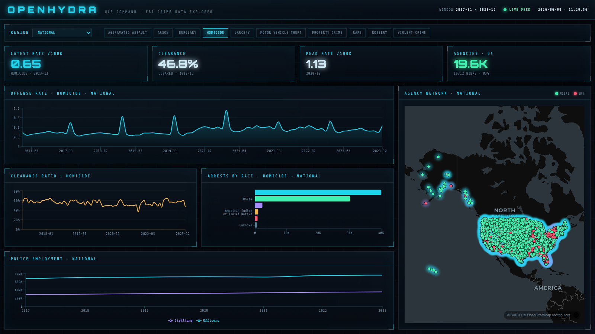

# OpenHydra

An end-to-end crime-data analytics platform built on the **FBI Crime Data
Explorer (CDE) API** — the FBI's public Uniform Crime Reporting (UCR) data for
the United States. Ingest → store → analyze → serve → visualize.

- **▶ Live demo:** https://openhydra-production.up.railway.app
- API docs: https://cde.ucr.cjis.gov/LATEST/webapp/#/pages/docApi
- Get a key: https://api.data.gov/signup/



> **Status: complete & deployed.** All six phases shipped — the `cdeclient`
> package, the DuckDB/dbt warehouse, analysis notebooks, the FastAPI service, the
> React/MapLibre command-center dashboard, and a live deployment on Railway
> (single image: FastAPI serves the API + the built dashboard). The dashboard
> is filterable by **region** (national + all 50 states + DC) across every
> panel — offense trends, clearance, **arrests-by-race per offense**, **police
> employment**, and a geocoded agency map. The API surface below is verified
> against the live API.

## Architecture

```
web/        React + Vite + TS dashboard (MapLibre GL map, Recharts)   ← frontend / dataviz
   │ REST/JSON
api/        FastAPI service over the warehouse (no API key in browser) ← backend
   │ reads
warehouse/  DuckDB + Parquet, transformed with dbt                     ← data engineering
analysis/   COVID-spike / clearance-rate / demographics notebooks      ← data science
   │ ETL writes
cdeclient/  typed Python client + CLI (retries, pydantic models)       ← SWE / packaging
   │ HTTP
FBI Crime Data Explorer API
```

## Tech stack

| Layer | Choice |
|---|---|
| Tooling | **uv** (env + packaging), **ruff** (lint/format), **mypy**, **pytest** |
| Client (`cdeclient`) | **httpx** · **pydantic v2** · **tenacity** (retries) · **Typer** (CLI) |
| Warehouse | **DuckDB** + **Parquet**, transforms via **dbt** (`dbt-duckdb`) |
| Analysis | **Jupyter** + **Polars** + **Plotly** |
| Backend | **FastAPI** + **uvicorn** |
| Frontend | **React** + **Vite** + **TypeScript**, TanStack Query, Tailwind, **Recharts**, **MapLibre GL** |
| Infra | **Docker Compose**, **GitHub Actions** CI, deploy on **Railway** |

Python is pinned to **3.12** via uv (the system Python is 3.14 — kept off the
critical path for wheel stability).

## Roadmap

- [x] **Phase 0** — API key, git, `explore.sh`, samples, verified API reference
- [x] **Phase 1** — `cdeclient`: typed client + CLI, retries, 20 tests, strict mypy, CI
- [x] **Phase 2** — ETL → DuckDB/Parquet warehouse (dbt models, 13 tests)
- [x] **Phase 3** — analysis notebooks + narrative (Polars + Plotly over the marts)
- [x] **Phase 4** — FastAPI service over the marts (7 tests, CORS, OpenAPI docs)
- [x] **Phase 5** — React/Vite/TS command-center dashboard (Recharts + MapLibre GL)
- [x] **Phase 6** — deployed to Railway (Dockerfile, live demo, screenshot, green CI)

## Setup

The API key lives in `.env` (git-ignored). Copy the template and add your key:

```bash
cp .env.example .env   # then edit FBI_CDE_API_KEY
```

## Pull sample data

```bash
./explore.sh
```

Hits one endpoint per family and writes JSON into `data/samples/` (plus
`data/samples/_manifest.tsv`). Retries through the gateway's intermittent `503`s.

## API reference (verified)

- **Base URL:** `https://api.usa.gov/crime/fbi/cde`
- **Auth:** append `?API_KEY=<key>` (query param) to every request
- **Returns:** JSON (read-only)
- **Date params:** most endpoints use **`MM-YYYY`** (e.g. `from=01-2020&to=12-2022`).
  The Police Employment (`/pe`) endpoints use **4-digit years** (`from=2018&to=2022`).

### Working endpoint families

| Family | Example path | Data shape |
|---|---|---|
| **Agencies** | `/agency/byStateAbbr/{ST}` | Object keyed by county → array of agencies. Each: `ori`, `agency_name`, `agency_type_name`, `latitude`, `longitude`, `is_nibrs`, `nibrs_start_date`, `counties`, `state_abbr`. (537 in NY; **19,619 across all 50 states + DC**.) **Geocoded → mapping.** |
| **Summarized** | `/summarized/{national\|state/{ST}\|agency/{ori}}/{offense}` | `offenses.rates` + `offenses.actuals`, each `{series → {MM-YYYY → value}}` with "…Offenses" and "…Clearances" series; plus `populations` and `cde_properties`. ⚠️ A **state** query also returns a `United States …` **benchmark** series — drop it or it collides with the state's own series. **Time-series / trends.** |
| **Arrests** | `/arrest/{national\|state/{ST}}/{offense}?type={totals\|counts}` | `type=totals` → demographic breakdowns (`Arrestee Sex`, `Arrestee Race`, `Male/Female Arrests By Age`, `Offense Name/Category/Breakdown`). ⚠️ `offense` is a **numeric code** (e.g. `11`=homicide, `70`=larceny), not the summarized slug — ingested per-offense via a slug→code map. `type=counts` → monthly time series. **Demographics + trends.** |
| **Police Employment** | `/pe?from=YYYY&to=YYYY` · `/pe/{ST}` · `/pe/{ST}/{ori}` | `rates` (LE employees per 1,000) + `actuals` (Male/Female Officers/Civilians) by year. ⚠️ Use these **canonical** paths — the `/pe/national` and `/pe/state/{ST}` variants answer `200` but return **all-`null`** values. Agency-level / older cells can still be sparse. |

### Verified offense slugs (summarized)

`violent-crime`, `homicide`, `rape`, `robbery`, `aggravated-assault`,
`property-crime`, `burglary`, `larceny`, `motor-vehicle-theft`, `arson`
(hyphenated, not `snake_case`).

### Known gaps / not found on this base

- `/estimate/*` and `/nibrs/*` incident-level demographics → `404` on the `cde`
  base with every path variant tried. They appear to live on the legacy `sapi`
  base / deprecated Swagger UI (`https://crime-data-api.fr.cloud.gov/swagger-ui/`).
  Revisit if the project needs national estimates or incident-level NIBRS data.

## Deploy

A single container (`Dockerfile`) serves everything: one stage builds the web
app, another builds the DuckDB marts from `deploy/seed/` via dbt, and the FastAPI
runtime serves the API **and** the static dashboard (same origin — no API key or
CORS in the browser). Live on Railway:

```bash
railway up        # builds the Dockerfile and deploys; FastAPI binds $PORT
```

## Layout

```
cdeclient/    typed Python CDE API client + CLI            (Phase 1)
warehouse/    ETL (oh-etl) + dbt → DuckDB/Parquet marts     (Phase 2)
analysis/     Polars + Plotly notebooks + FINDINGS.md       (Phase 3)
api/          FastAPI service over the marts (oh-api)       (Phase 4)
web/          React + Vite + MapLibre command-center UI     (Phase 5)
Dockerfile    one image: web build → dbt marts → API+static (Phase 6)
docs/         verified API reference + dashboard screenshot
data/samples/ saved sample API responses (fixtures)
.env          API key + base URL (git-ignored)
```
