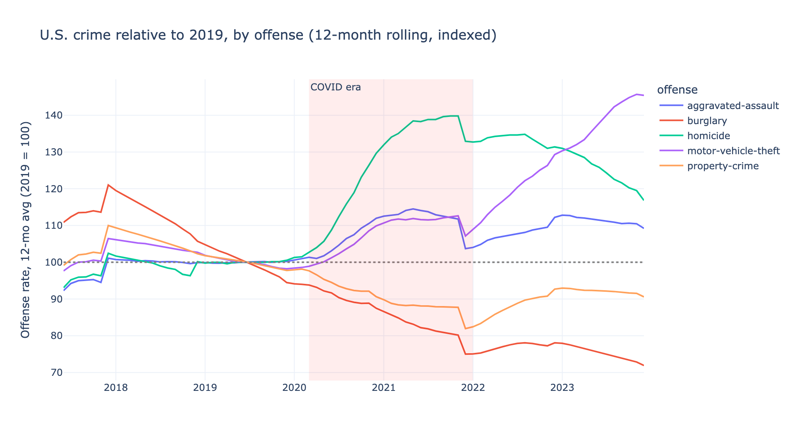
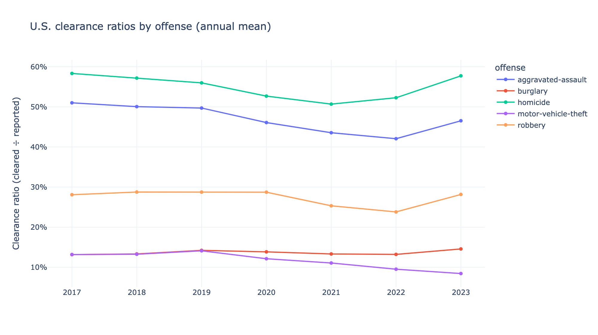
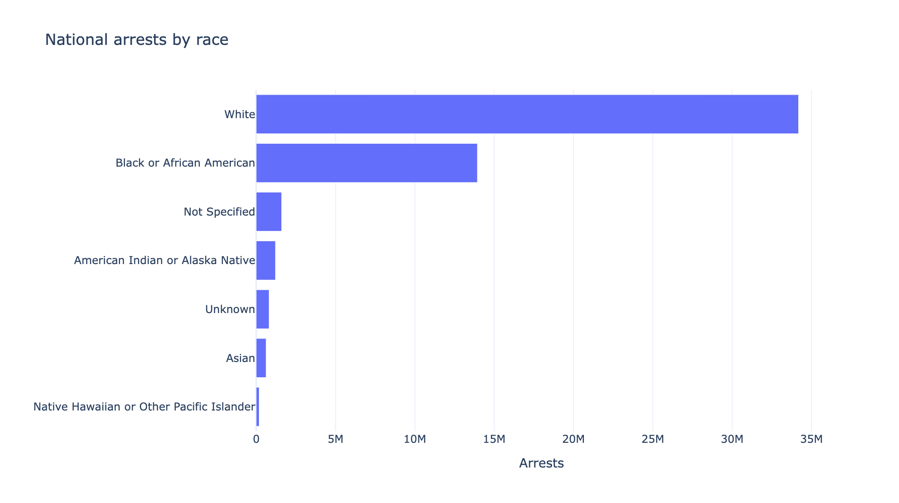
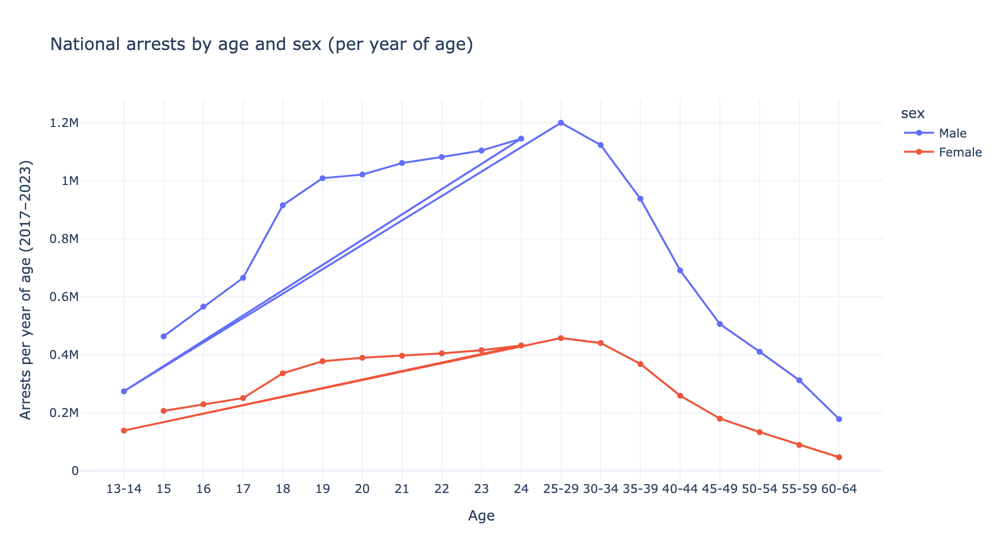

# OpenHydra — findings: U.S. crime trends, 2017–2023

National analysis over the DuckDB marts (`fct_offenses_monthly`, `fct_arrests`)
built by the [warehouse](../warehouse) layer. Source notebook:
[`notebooks/01_crime_trends.py`](notebooks/01_crime_trends.py) (paired `.ipynb`).
Charts in [`outputs/`](outputs).

> Data caveats: national figures; offense series are FBI UCR rates per 100k;
> "clearance ratio" is monthly cleared ÷ reported (a standard proxy, not a cohort
> rate); arrest demographics are 2017–2023 totals. Coverage varies year to year.

## 1. Crime did not uniformly "spike" in COVID — it split

Indexing each offense's 12-month-average rate to its 2019 level (=100) separates
the signal from seasonality:

- **Homicide** rose to **~140% of 2019**, peaking in late 2021, then receded toward
  ~110% by 2023 — the sharpest violent-crime swing.
- **Aggravated assault** rose and stayed elevated (~110%+).
- **Motor-vehicle theft** is the standout late mover: flat through 2020, then a
  steep climb to **~145% of 2019 by late 2023**.
- **Burglary (~73%)** and **property crime (~90%)** kept *falling* throughout.

So the "COVID crime wave" was really a **violence + auto-theft** story; property
and burglary continued their long-run decline.

## 2. Clearance rates dipped during COVID — and motor-vehicle theft never recovered

- **Homicide** clearance fell from **~58% (2017) to ~51% (2021)**, then recovered to
  ~58% by 2023.
- **Aggravated assault** slid from ~51% to ~42%.
- **Motor-vehicle theft** clearance kept declining to **~8.5%** — fewer than 1 in 12
  solved, even as MVT offenses surged (see chart 1). That gap is the most striking
  result here.

## 3. Arrests by race

2017–2023 totals: White ~34M and Black or African American ~14M dominate the
recorded totals, with all other groups well under 2M each.

## 4. The age–crime curve

Normalizing the mixed single-year/5-year buckets to **arrests per year of age**
recovers the classic age–crime curve: arrests rise sharply through the late teens,
**peak at 25–29**, then decline steadily. Male arrests run **~2.7× female** across
the whole curve.

---

*Reproduce:* `cd analysis && uv sync && uv run python notebooks/01_crime_trends.py`
(after building the warehouse — see [../warehouse](../warehouse)).
