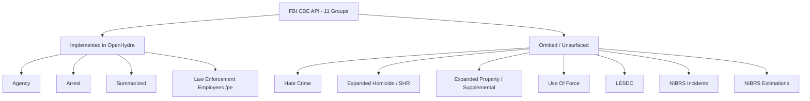

# FBI Crime Data Explorer (CDE) API Mapping & Gap Analysis

This report provides a comprehensive mapping of the FBI Crime Data Explorer (CDE) API, compares it to the OpenHydra repository, and highlights all data dimensions and endpoints that are currently underutilized or completely unsurfaced in the frontend dashboard.

---

## 1. API Overview & Endpoint Inventory

The FBI CDE API is a read-only REST service returning JSON or CSV data. Authenticated via query parameter (`?API_KEY=<key>`), it exposes **39 paths** organized into **11 distinct endpoint groups**.

Below is the complete inventory of these groups and their endpoints, as documented in the OpenAPI spec (`openapi.json`):

| Endpoint Group | Description | Endpoints (Paths) |
| :--- | :--- | :--- |
| **Agency** | Reporting agency metadata | `GET /agency/{query}/{value}` |
| **Arrest** | Arrests, citations, and summons counts | `GET /arrest/national/{offense}` `GET /arrest/state/{state}/{offense}` `GET /arrest/agency/{ori}/{offense}` |
| **Summarized** | Reported and estimated offense/clearance series | `GET /summarized/national/{offense}` `GET /summarized/state/{state}/{offense}` `GET /summarized/agency/{ori}/{offense}` |
| **Law Enforcement Employees** | Police employment demographics and counts | `GET /pe` `GET /pe/{state}` `GET /pe/{state}/{ori}` |
| **Hate Crime** | Hate crime incidents and bias motivations | `GET /hate-crime/national` `GET /hate-crime/national/{bias}` `GET /hate-crime/state/{state}` `GET /hate-crime/state/{state}/{bias}` `GET /hate-crime/agency/{ori}` `GET /hate-crime/agency/{ori}/{bias}` |
| **Expanded Homicide (SHR)** | Supplementary Homicide Reports | `GET /shr/national` `GET /shr/state/{state}` `GET /shr/agency/{ori}` |
| **Expanded Property** | Value and types of stolen/recovered property | `GET /supplemental/national/{offense}` `GET /supplemental/state/{state}/{offense}` `GET /supplemental/agency/{ori}/{offense}` |
| **Use Of Force** | Law enforcement use of force statistics | `GET /participation/national/{collection}/{query}` `GET /participation/national/uof/{query}` `GET /participation/state/{state}/{collection}/{query}` `GET /uof/questions/{grp}/{year}/{quarter}` `GET /uof/reports/{grp}/{spec}` |
| **LESDC** | Law Enforcement Suicide Data Collection | `GET /lesdc` |
| **NIBRS** | Detailed incident-based offender/victim details | `GET /nibrs/national/{offense}` `GET /nibrs/state/{state}/{offense}` `GET /nibrs/agency/{ori}/{offense}` |
| **NIBRS Estimations** | Incident-based estimation models | `GET /nibrs-estimation/lookup/{lookup}` `GET /nibrs-estimation/national/{offense}` `GET /nibrs-estimation/national/agency-type/{type}/{location}/{offense}` `GET /nibrs-estimation/national/size/{type}/{desc}/{offense}` `GET /nibrs-estimation/region/{region}/{offense}` `GET /nibrs-estimation/region/agency-type/{region}/{type}/{location}/{offense}` `GET /nibrs-estimation/region/size/{region}/{type}/{desc}/{offense}` `GET /nibrs-estimation/state/{state}/{offense}` |

---

## 2. API vs. Repository Comparison

The OpenHydra codebase has varying degrees of implementation for the 11 API groups:

### Gap Analysis Across Codebase Layers

| Group | Python Client (`cdeclient`) | ETL Warehouse (`openhydra_etl`) | Backend API (`openhydra_api`) | Frontend (`web`) |
| :--- | :---: | :---: | :---: | :---: |
| **Agency** | ✅ Yes | ✅ Yes (`dim_agencies`) | ✅ Yes (`/api/agencies`) | ✅ Yes (Interactive Map) |
| **Summarized** | ✅ Yes | ✅ Yes (`fct_offenses_monthly`) | ✅ Yes (`/api/offenses/monthly`) | ✅ Yes (Trend / Clearance charts) |
| **Arrest** | ✅ Yes | ✅ Yes (`fct_arrests`) | ✅ Yes (`/api/arrests`) | ⚠️ Partial (Race chart only) |
| **LE Employees** | ✅ Yes | ✅ Yes (`fct_police_employment`) | ✅ Yes (`/api/police-employment`) | ✅ Yes (Employment chart) |
| **Hate Crime** | ✅ Yes | ✅ Yes (`fct_hate_crime`) | ✅ Yes (`/api/hate-crime` + live agency proxy) | ✅ Yes (Hate Crime view) |
| **Exp. Homicide** | ✅ Yes | ✅ Yes (`fct_shr`) | ✅ Yes (`/api/shr` + live agency proxy) | ✅ Yes (Homicide view) |
| **Exp. Property** | ✅ Yes | ✅ Yes (`fct_property`) | ✅ Yes (`/api/property` + live agency proxy) | ✅ Yes (Property view) |
| **Use Of Force** | ❌ No | ❌ No | ❌ No | ❌ No |
| **LESDC** | ✅ Yes | ✅ Yes (`fct_lesdc`) | ✅ Yes (`/api/lesdc`, national only) | ✅ Yes (LESDC view) |
| **NIBRS Incidents** | ✅ Yes | ✅ Yes (`fct_nibrs`, curated offenses) | ✅ Yes (`/api/nibrs` + live agency proxy) | ✅ Yes (NIBRS view) |
| **NIBRS Estimations**| ❌ No | ❌ No | ❌ No | ❌ No |

---

## 3. Geographic (State) Code Mapping

The OpenAPI schema `states` contains **54** values, representing the 50 US states, District of Columbia, and three territories/federal systems.

### Gaps in State Definitions

The local repository defines states in `cdeclient/src/cdeclient/constants.py` and name-maps them in `web/src/lib/states.ts`. Both files define exactly **51** options, omitting three codes returned by the API:

1. **`FS` (Federal Agencies / Federal System)**
   - **API Availability:** Returns 86 federal reporting agencies (such as the DEA, FBI, etc.) and active crime stats.
   - **Codebase Status:** Absent.
2. **`GM` (Guam)**
   - **API Availability:** Under `/agency/byStateAbbr/GM`, the API returns a metadata envelope without an agency list.
   - **Codebase Status:** Absent.
3. **`VI` (U.S. Virgin Islands)**
   - **API Availability:** Returns 2 active reporting agencies.
   - **Codebase Status:** Absent.

> [!WARNING]
> **API Structural Difference Bug (Guam - `GM`)**
> If Guam (`GM`) were added to the list of queryable states in the codebase, the Python client `cdeclient` would throw a **`ValidationError`** and crash. This is because the API returns a metadata dictionary `{"cde_agencies_query": {...}}` for Guam instead of the standard state-level dictionary mapping county names to lists of agency objects (e.g., `dict[str, list[Agency]]`).

---

## 4. Arrest Code Mapping

The CDE API accepts **48** numeric arrest offense codes for its `/arrest` endpoints. These codes trace their lineage to the traditional **UCR Summary Reporting System (SRS) Part I and Part II offenses** but are shifted into a 3-digit taxonomy.

By querying the live API for each code and filtering out zero-value responses, we have mapped every single one of the 48 codes to its exact name and category:

### Detailed Arrest Offense Code Map

| Code | Offense Name | Offense Category (UCR Group) |
| :---: | :--- | :--- |
| **`all`** | *All Offenses Rollup* | *All Offenses Rollup* |
| **`11`** | Murder and Nonnegligent Homicide | Homicide Offenses |
| **`12`** | Manslaughter by Negligence | Homicide Offenses |
| **`20`** | Rape (Legacy) | Sex Offenses |
| **`23`** | Rape (Revised Definition) *(Returns 0 arrests in 2022)* | Sex Offenses |
| **`30`** | Robbery | Robbery |
| **`50`** | Aggravated Assault | Aggravated Assault |
| **`55`** | Simple Assault | Simple Assault |
| **`60`** | Burglary | Burglary |
| **`70`** | Larceny | Larceny |
| **`90`** | Motor Vehicle Theft | Motor Vehicle Theft |
| **`101`** | Human Trafficking (Involuntary Servitude) | Human Trafficking |
| **`102`** | Human Trafficking (Commercial Sex Acts) | Human Trafficking |
| **`110`** | Arson | Arson |
| **`140`** | Prostitution and Commercialized Vice (General) | Prostitution Offenses |
| **`141`** | Assisting or Promoting Prostitution | Prostitution Offenses |
| **`142`** | Purchasing Prostitution | Prostitution Offenses |
| **`143`** | Other Prostitution / Commercial Sex | Prostitution Offenses |
| **`150`** | Drug Abuse Violations (General Rollup) | Drug/Narcotic Offenses |
| **`151`** | Drug Sale/Manufacturing - Opium/Cocaine & derivatives | Drug/Narcotic Offenses |
| **`152`** | Drug Sale/Manufacturing - Marijuana | Drug/Narcotic Offenses |
| **`153`** | Drug Sale/Manufacturing - Synthetic Narcotics | Drug/Narcotic Offenses |
| **`154`** | Drug Sale/Manufacturing - Other Dangerous Drugs | Drug/Narcotic Offenses |
| **`155`** | Drug Sale/Manufacturing - Unspecified / Other | Drug/Narcotic Offenses |
| **`156`** | Drug Possession - Opium/Cocaine & derivatives | Drug/Narcotic Offenses |
| **`157`** | Drug Possession - Marijuana | Drug/Narcotic Offenses |
| **`158`** | Drug Possession - Synthetic Narcotics | Drug/Narcotic Offenses |
| **`159`** | Drug Possession - Other Dangerous Drugs | Drug/Narcotic Offenses |
| **`160`** | Drug Possession - Unspecified / Other | Drug/Narcotic Offenses |
| **`170`** | Gambling (General Rollup) | Gambling Offenses |
| **`171`** | Gambling - Bookmaking | Gambling Offenses |
| **`172`** | Gambling - Numbers and Lottery | Gambling Offenses |
| **`173`** | Gambling - Other / Unspecified | Gambling Offenses |
| **`180`** | Counterfeiting/Forgery | Counterfeiting/Forgery |
| **`190`** | Fraud | Fraud Offenses |
| **`200`** | Embezzlement | Embezzlement |
| **`210`** | Stolen Property (Buying, Receiving, Possessing) | Stolen Property Offenses |
| **`220`** | Vandalism | Destruction/Damage/Vandalism of Property |
| **`230`** | Weapons (Carrying, Possessing, etc.) | Weapon Law Violations |
| **`240`** | Sex Offenses (except Rape and Prostitution) | Sex Offenses, Non-forcible |
| **`250`** | Offenses Against the Family and Children | Family Offenses, Nonviolent |
| **`260`** | Drive Under the Influence | Drive Under the Influence |
| **`270`** | Liquor Law Violations | Liquor Law Violations |
| **`280`** | Drunkenness | Drunkenness |
| **`290`** | Disorderly Conduct | Disorderly Conduct |
| **`300`** | Vagrancy | Vagrancy/Loitering |
| **`310`** | All Other Offenses | All Other Offenses |
| **`330`** | Curfew and Loitering Law Violations | Vagrancy/Loitering |

---

## 5. What Has NOT Been Surfaced in the Frontend Dashboard?

Despite the rich datasets supported by the FBI API, the OpenHydra frontend dashboard ignores a vast amount of available information.

### 1. Entire Endpoint Groups Omitted
*   **Hate Crime:** Motivations (race, religion, sexual orientation, disability, gender identity) and offender/victim demographics.
*   **Expanded Homicide (SHR):** Weapon types, victim-offender relationships, circumstances (felony-murders, brawls).
*   **Expanded Property (Supplemental):** Stolen vs. recovered property categories (cash, jewelry, vehicles, firearms) and values.
*   **Use of Force:** Participation stats, officer-involved shootings, injury and death details.
*   **LESDC:** Law Enforcement suicide demographics, Wellness programs, and duty status details.
*   **NIBRS Incidents & Estimations:** Granular incident details (victim/offender counts, locations, time of day).

### 2. Unsurfaced Demographic Dimensions of Arrests
The DuckDB warehouse currently fetches and stores a comprehensive set of arrest demographics in the `fct_arrests` table. However, the React frontend *hardcodes* queries for `"Arrestee Race"` and leaves the following categories completely unrendered:
*   **`Arrestee Sex`:** Male vs. Female arrest ratios.
*   **`Male Arrests By Age` & `Female Arrests By Age`:** Full age distributions (e.g., ages 10–12, 13–14, 15, 16, 17, 18, 19, 20–24, etc.).
*   **`Offense Name` / `Offense Category` / `Offense Breakdown`:** The specific distribution of offenses when performing rollups (e.g. showing which specific drug types make up "Drug Abuse Violations").

### 3. Underutilized Arrest Codes

The codebase contains a mapping dictionary `ARREST_OFFENSE_CODES` in [constants.py](file:///Users/carlo/Documents/Development/personal/OpenHydra/cdeclient/src/cdeclient/constants.py) that only links the **10 core offenses** (such as homicide, robbery, larceny) to their corresponding codes. 

This leaves **38 functional arrest offense codes** (plus the unmapped code `23` for revised Rape definition) completely unused by the application. These codes are never fetched by the ETL, exposed as distinct metrics, or selectable as filter options in the UI.

Below is the complete list of these underutilized codes, including the specific crime category they are tied to in the CDE API:

| Code | Offense Name | Category |
| :---: | :--- | :--- |
| **`12`** | Manslaughter by Negligence | Homicide Offenses |
| **`23`** | Rape (Revised Definition) *(Unmapped/empty in CDE)* | Sex Offenses |
| **`55`** | Simple Assault | Simple Assault |
| **`101`** | Human Trafficking (Involuntary Servitude) | Human Trafficking |
| **`102`** | Human Trafficking (Commercial Sex Acts) | Human Trafficking |
| **`140`** | Prostitution and Commercialized Vice (General Rollup) | Prostitution Offenses |
| **`141`** | Assisting or Promoting Prostitution | Prostitution Offenses |
| **`142`** | Purchasing Prostitution | Prostitution Offenses |
| **`143`** | Other Prostitution / Commercial Sex | Prostitution Offenses |
| **`150`** | Drug Abuse Violations (General Rollup) | Drug/Narcotic Offenses |
| **`151`** | Drug Sale/Manufacturing - Opium/Cocaine & derivatives | Drug/Narcotic Offenses |
| **`152`** | Drug Sale/Manufacturing - Marijuana | Drug/Narcotic Offenses |
| **`153`** | Drug Sale/Manufacturing - Synthetic Narcotics | Drug/Narcotic Offenses |
| **`154`** | Drug Sale/Manufacturing - Other Dangerous Drugs | Drug/Narcotic Offenses |
| **`155`** | Drug Sale/Manufacturing - Unspecified / Other | Drug/Narcotic Offenses |
| **`156`** | Drug Possession - Opium/Cocaine & derivatives | Drug/Narcotic Offenses |
| **`157`** | Drug Possession - Marijuana | Drug/Narcotic Offenses |
| **`158`** | Drug Possession - Synthetic Narcotics | Drug/Narcotic Offenses |
| **`159`** | Drug Possession - Other Dangerous Drugs | Drug/Narcotic Offenses |
| **`160`** | Drug Possession - Unspecified / Other | Drug/Narcotic Offenses |
| **`170`** | Gambling (General Rollup) | Gambling Offenses |
| **`171`** | Gambling - Bookmaking | Gambling Offenses |
| **`172`** | Gambling - Numbers and Lottery | Gambling Offenses |
| **`173`** | Gambling - Other / Unspecified | Gambling Offenses |
| **`180`** | Counterfeiting/Forgery | Counterfeiting/Forgery |
| **`190`** | Fraud | Fraud Offenses |
| **`200`** | Embezzlement | Embezzlement |
| **`210`** | Stolen Property (Buying, Receiving, Possessing) | Stolen Property Offenses |
| **`220`** | Vandalism | Destruction/Damage/Vandalism of Property |
| **`230`** | Weapons (Carrying, Possessing, etc.) | Weapon Law Violations |
| **`240`** | Sex Offenses (except Rape and Prostitution) | Sex Offenses, Non-forcible |
| **`250`** | Offenses Against the Family and Children | Family Offenses, Nonviolent |
| **`260`** | Drive Under the Influence | Drive Under the Influence |
| **`270`** | Liquor Law Violations | Liquor Law Violations |
| **`280`** | Drunkenness | Drunkenness |
| **`290`** | Disorderly Conduct | Disorderly Conduct |
| **`300`** | Vagrancy | Vagrancy/Loitering |
| **`310`** | All Other Offenses | All Other Offenses |
| **`330`** | Curfew and Loitering Law Violations | Vagrancy/Loitering |

