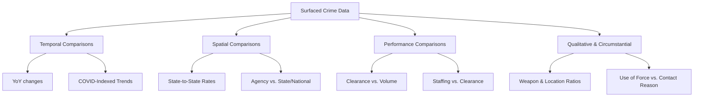

# Crime & Law Enforcement Data: Comparative Analytics Report

This report evaluates the data surfaced in the [OpenHydra](file:///Users/carlo/Documents/Development/personal/OpenHydra) front end, outlines various comparative and analytical methodologies, and ranks them in order of potential usefulness for policy-makers, researchers, and public safety officers.

## 1. Overview of Surfaced Frontend Data

The OpenHydra frontend (defined across [web/src/views/](file:///Users/carlo/Documents/Development/personal/OpenHydra/web/src/views)) surfaces data across several primary crime and law enforcement domains:

*   **Overview View ([OverviewView.tsx](file:///Users/carlo/Documents/Development/personal/OpenHydra/web/src/views/OverviewView.tsx)):** Displays monthly offense rates (per 100k), clearance ratios (cleared/reported), arrest demographics (race, sex, age), police employment (officers vs. civilians), and an interactive geographical map overlay showing agency locations and UCR reporting styles (NIBRS vs. SRS).
*   **Hate Crime View ([HateCrimeView.tsx](file:///Users/carlo/Documents/Development/personal/OpenHydra/web/src/views/HateCrimeView.tsx)):** Breaks down bias incidents by Bias Category, Bias Motivation, Offender Race, Victim Type, Location Type, and Offense Type.
*   **Homicide View ([HomicideView.tsx](file:///Users/carlo/Documents/Development/personal/OpenHydra/web/src/views/HomicideView.tsx)):** Surfaces Supplementary Homicide Report (SHR) details including weapons used, crime circumstances, victim-offender relationship, victim demographics (race, age), and offender race.
*   **Property View ([PropertyView.tsx](file:///Users/carlo/Documents/Development/personal/OpenHydra/web/src/views/PropertyView.tsx)):** Focuses on Burglary, Larceny, Motor Vehicle Theft, and Robbery, displaying stolen/recovered values, location counts, and average stolen value.
*   **NIBRS Incident View ([NibrsView.tsx](file:///Users/carlo/Documents/Development/personal/OpenHydra/web/src/views/NibrsView.tsx)):** Displays incident details for 12 crime categories, breaking them down by weapon, victim-offender relationship, location, and demographics.
*   **NIBRS Estimation View ([NibrsEstimationView.tsx](file:///Users/carlo/Documents/Development/personal/OpenHydra/web/src/views/NibrsEstimationView.tsx)):** Provides modeled national and regional estimated counts for major crime offenses, displaying location, weapons, victim demographics, arrestee demographics, and clearance status.
*   **Use of Force View ([UseOfForceView.tsx](file:///Users/carlo/Documents/Development/personal/OpenHydra/web/src/views/UseOfForceView.tsx)):** Tracks national agency reporting participation alongside breakdowns of force type, means of resistance, and reason for contact.
*   **Law Enforcement Suicide (LESDC) View ([LesdcView.tsx](file:///Users/carlo/Documents/Development/personal/OpenHydra/web/src/views/LesdcView.tsx)):** Breaks down officer suicide and attempted suicide incidents by year, manner of death, duty status, years of experience, demographics, and agency wellness programs.

---

## 2. Comparative Framework

To extract maximum value from these datasets, they can be compared and analyzed across multiple dimensions:

---

## 3. Ranked Analytical Methods (by Potential Usefulness)

The analytical methods below are ranked based on their **actionability** (ability to guide policy and policing decisions), **explanatory power** (ability to uncover underlying drivers), and **data reliability** (resilience to reporting gaps).

---

### Rank 1: State-to-State & Agency-to-State/National Benchmarking (Spatial/Per Capita)
> [!IMPORTANT]
> Because law enforcement in the U.S. is highly decentralized, absolute crime numbers are not directly comparable. Adjusting data per capita (e.g., rate per 100,000 residents) is essential for meaningful spatial comparisons.

*   **How it works:** 
    *   Compare the crime rate of a specific state or agency against state averages or national baselines.
    *   Compute relative indices: $\text{Relative Crime Index} = \frac{\text{Agency Crime Rate}}{\text{State Average Rate}} \times 100$.
*   **Why it is useful:** Identifies geographical outliers. It answers questions like: *Is a local spike in homicides a municipal anomaly, or does it follow a wider statewide or national trend?* This helps state and federal agencies allocate resources to regional hotspots.
*   **Data Constraints:** Requires accurate and up-to-date population estimates for each agency jurisdiction (or county) to serve as the denominator.
*   **Application Example:** Comparing a state's homicide rate to the national average, or showing that a particular municipality's auto-theft rate is $3\times$ the state average.

---

### Rank 2: Year-over-Year (YoY) & Multi-Year Indexed Trend Analysis (Temporal)
*   **How it works:** 
    *   Calculate YoY percentage changes for specific months to remove seasonality (e.g., comparing Dec 2023 to Dec 2022).
    *   Index multi-year trends to a baseline year (e.g., setting 2019 to $100$ and tracking subsequent years, as done in [FINDINGS.md](file:///Users/carlo/Documents/Development/personal/OpenHydra/analysis/FINDINGS.md)).
*   **Why it is useful:** Separates short-term seasonal fluctuations from long-term structural changes. It reveals structural inflections—such as the massive rise in motor-vehicle thefts post-2021 ($+45\%$ vs. 2019) or the peak and subsequent decline of homicides during the COVID-19 era.
*   **Data Constraints:** Changes in reporting standards (e.g., the transition from Summary Reporting System (SRS) to NIBRS in 2021) can create artificial shifts in the trend line if some agencies fail to report in the transitional years.
*   **Application Example:** Evaluating whether the post-pandemic decline in homicide rates has returned to pre-2020 levels.

---

### Rank 3: Clearance Rate vs. Staffing & Crime Volume (Performance Correlation)
*   **How it works:** 
    *   Plot clearance ratios (cases cleared $\div$ cases reported) against crime volumes over time.
    *   Correlate clearance ratios with police staffing rates (officers per 1,000 residents, from `fct_police_employment`).
*   **Why it is useful:** It measures police effectiveness and investigates capacity overload. For example, OpenHydra's preliminary findings show that as motor-vehicle theft rates skyrocketed, the clearance rate fell to an abysmal $8.5\%$. This suggests a "saturation threshold" where agencies fail to keep pace with specific surges.
*   **Data Constraints:** Clearance ratios are calculated monthly as clearances divided by reports, which can occasionally exceed $100\%$ if cold cases are solved during low-crime months.
*   **Application Example:** Charting whether higher officer-to-population ratios in certain states lead to higher clearance rates for violent crimes.

---

### Rank 4: Qualitative Circumstantial Analysis (Modus Operandi & Context)
*   **How it works:** 
    *   Analyze breakdown shares from Homicide (SHR) and NIBRS: weapon types used, victim-offender relationship, and location types.
    *   Track the recovery-to-stolen value ratio for property crimes across robbery, burglary, larceny, and motor-vehicle theft.
*   **Why it is useful:** Informs localized prevention strategies. If homicides in a state are overwhelmingly committed with firearms ($70\%+$) in residential areas by acquaintances, it demands different social and policy interventions than if they are street-level crimes committed with knives by strangers.
*   **Data Constraints:** Substantial missing data in detailed categories (e.g., "unknown relationship" or "unknown weapon" are frequent entries in SHR/NIBRS).
*   **Application Example:** Comparing the recovery rate of stolen motor vehicles ($60\text{–}70\%$ usually, though clearance is low) to larceny/theft ($<10\%$).

---

### Rank 5: Reporting Integrity & Participation Auditing (Data Quality Tracker)
*   **How it works:** 
    *   Track the percentage of active state agencies reporting through NIBRS rather than the older SRS system.
    *   Monitor Use of Force reporting participation over time (from `fct_uof_participation`).
*   **Why it is useful:** Acts as a data quality audit. High crime rates in a state might reflect thorough NIBRS reporting rather than an actual crime wave, whereas a state with low NIBRS participation will report deceptively low crime rates due to missing agency reports.
*   **Data Constraints:** None; this is a meta-analysis of the dataset itself.
*   **Application Example:** Explaining why a state's crime rate seemingly dropped in 2021 by showing that $50\%$ of its agencies failed to report data after the FBI's strict NIBRS transition.

---

## 4. Comparison and Feasibility Matrix

| Analysis Method | Actionability | Explanatory Power | Data Reliability | Implementation Complexity | Primary Data Source |
| :--- | :--- | :--- | :--- | :--- | :--- |
| **1. Spatial Benchmarking** | **High** | High | Medium | Medium (needs population data) | `fct_offenses_monthly` & `dim_agencies` |
| **2. YoY Temporal Trends** | **High** | Medium | High | Low | `fct_offenses_monthly` |
| **3. Clearance vs. Staffing** | Medium | **High** | Medium | Medium | `fct_offenses_monthly` & `fct_police_employment` |
| **4. Circumstantial Modus Operandi** | High | Medium | Low (high missing values) | Low | `fct_shr`, `fct_nibrs`, `fct_property` |
| **5. Reporting Integrity Audits** | Low | Low | High | Low | `dim_agencies` & `fct_uof_participation` |

---

## 5. Implementation Recommendations

To bring these comparisons into the OpenHydra frontend, the following engineering steps are recommended:

1.  **Integrate Census Population Data:** Load state and county-level Census population projections into the DuckDB warehouse. This will allow the API to return per-capita state and local agency rates, rather than raw volumes.
2.  **Add a Benchmark Toggle in Frontend:** In `OverviewView.tsx`, allow users to toggle between "Absolute Rate" and "Relative to National/State Average".
3.  **Introduce a "YoY Delta" Metric:** Display a small indicator next to the `Latest Rate` tile (e.g., `+4.2% YoY` or `-8.1% vs. 2019 baseline`) using trailing 12-month averages.
4.  **Create a Performance Dashboard View:** Implement a specialized view correlating crime volume, officer staffing (officers per 1,000 residents), and clearance rates, allowing policy-makers to visualize resource constraints.
